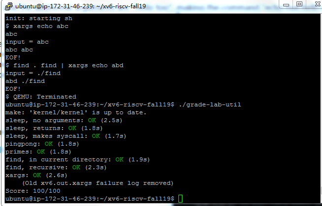

> sleep.c的实现

```C
#include"kernel/types.h"
#include"user/user.h"  // 休眠毫秒数，t = 100，休眠十秒，我也没搞清楚单位咋回事
int
main(int argc, char *argv[])
{
    int t;
    if( argc<2 ){
        fprintf(2, "usage: sleep time...\n");
        exit();
    }
    t = atoi(argv[1]);
    sleep(t);
    exit();
}
```
头文件的话，user.h中的用户函数声明，

有些函数的参数出现了uint类型和struct stat类型

前者是在kernel/types.h，typedef定义的一个无符号int类型

而后者其实在user.h里面也是有声明的，所以其实可以不必每次都带上kernel/stat.h

> pingpong.c的实现

```C
#include "kernel/types.h"
#include "user/user.h"
#define MAXSIZE 10

int
main(void)
{
    int parent_fd[2];
    int child_fd[2];
    int ppid, pid;
    char content[2] = "a";
    char buffer[MAXSIZE];
    pipe(parent_fd);
    pipe(child_fd);
    if(fork()==0){
        pid = getpid();
        close(parent_fd[0]);
        close(child_fd[1]);
        read(child_fd[0],buffer,1);
        printf("%d: received ping\n",pid);
        write(parent_fd[1],buffer,1);
        exit();
    }
    else{
        close(parent_fd[1]);
        close(child_fd[0]);
        ppid = getpid();
        write(child_fd[1],content,1);
        read(parent_fd[0],buffer,1);
        printf("%d: received pong\n",ppid);
    }
    wait();
    exit();
}
```
pipe两个进程间通信，考虑要用两个pipe

假如是一个pipe，在父进程，写完了准备读，在子进程读到了，准备写

因为进程切换是难以预测的，所以这个例子里父进程写完之后，可能是父进程直接自己读取了pipe里的内容

而不是想要的等子进程读完写入，在由父进程读。


> primes.c的实现


```C
#include "kernel/types.h"
#include "user/user.h"

int main(void){
    int p[2], i;
    int primes[35];
    int buffer,buffer2, prime;

    for(i=0;i<34;i++)
            primes[i] = i+2;  
    primes[i] = 0;      // primes[0] = 2, primes[32] = 34, primes[33] = 35,primes[34] = 0,
    
    pipe(p);

    while(1){
        i = 0;
        if(fork()==0){
            read(p[0],&prime,4);
            if(prime==0)
                exit();
            printf("prime %d\n",prime);
            while(1){
                read(p[0],&buffer2,4);
                if((buffer2%prime!=0)||(buffer2==0)){
                                primes[i] = buffer2;
                                i++;
                }
                if(buffer2==0)
                        break;
            }
            //printf("After pid == %d rean %d numbers:\n",getpid(),i);
            //for(i=0;i<34;i++)              //能清晰的看到每次子进程读取结束后新数组的变化
            //      printf("%d ",primes[i]);
            //printf("\n");
        }
        else{
            while(1){
                //read(0,&buffer,1);    // 用于调试，strace可以跟踪子进程的系统调用，只要知道pid
                write(p[1],primes+i,4);
                if(primes[i]==0)
                        break;
                i++;
            }
            wait();
            exit();
        }
    }
    exit();
}
```
这里用的方法是有点像递归吧，父进程做两件事，一是fork子进程，

二是向子进程把数组（int数组传输碰到0代表结束）全部写进去（利用了pipe进程间通信）

传输完，开始等待子进程结束，则父进程结束。

而在子进程中有选择的从pipe里读取收到的数字，写到数组里，以0结尾。

然后开始下一轮循环，这时候子进程作为父进程，fork出它的子进程，自己作为父进程向pipe里面写

孙子进程则有选择的读

重复循环，直到读不到有效的数字，一层一层的在wait的父进程开始exit，

> find.c的实现


```C
#include "kernel/types.h"
#include "kernel/stat.h"
#include "user/user.h"
#include "kernel/fs.h"

void
find(char *path, char *file)
{
    struct stat st;
    struct dirent de;
    int fd;

    if((fd = open(path, 0)) < 0){
        fprintf(1,"find: cannot open %s\n", path);
        return;
    }  // 现在得到的当前path(其实也有可能不是dir,eg find 1.c 1.c)的文件标识符，>一切皆文件，descriptior

    if(fstat(fd, &st) < 0){             //得到path的st类结构体信息
        fprintf(1,"find: cannot stat %s\n", path);
        close(fd);
        return;
    }

    switch(st.type){

        case T_FILE: {    //因为是file，所以不递归进去了，判断是不是同名，同名就返回
            char *p = path+strlen(path)-1;
            while(*p!='/')
                    p--;
            if(strcmp(++p, file)==0){
                fprintf(1,"%s\n",path);
                close(fd);
                return;   //找到也不exit，因为可能有同名文件，继续递归
            }
            close(fd);
            return; // 名字不匹配,递归其他的
        }

        case T_DIR: {   // 假如不是 '.','..'(这俩也是dir),就递归进去，继续find
            char new_path[sizeof(path)+DIRSIZ];
            while(read(fd,&de,sizeof(de))==sizeof(de)){
                //printf("Read %s in path: %s\n",de.name,path);
                if(strcmp(de.name,".")==0||strcmp(de.name,"..")==0)
                        continue;
                if(de.name[0] == '\0')
                        break;
                strcpy(new_path,path);
                new_path[strlen(path)] = '/';
                strcpy(new_path+strlen(path)+1,de.name);
                find(new_path,file);
            }
        }
    }
    close(fd);
}

int
main(int argc, char **argv)
{
    if(argc != 3){
        fprintf(1,"Usage: find . a \n");
        exit();
    }
    else{
        find(argv[1], argv[2]);
    }
    exit();
}


```
要搞清楚linux的文件结构，路径文件也可以open，而它的stat结构，stat.type是T_DIR

那么其实这个路径文件的结构是条目组，可以循环read(fd,&de,sizeof(de))

每次读出来的sizeof(de)个字节大小的内容，放到struct dirent结构体里
```
struct dirent {
  ushort inum;
  char name[DIRSIZ];
};
```
后者就是这一次读出的条目的名字。

> xargs.c的实现

```C
#include "kernel/param.h"
#include "kernel/types.h"
#include "user/user.h"


int
xargs(int argc, char **argv){
    int n;
    char *new_argv[MAXARG];
    char *p;
    char buffer[100];
    p = buffer;

    while((n = read(0,p,1))==1&&*p!='\n'){
            p++;
        }
    if(n<=0){
        //write(1,"EOF!\n",6);
        exit();
    }
    *p=0;
    //printf("input = %s\n",buffer);
    if(fork()==0){
        new_argv[0] = argv[1];
        new_argv[1] = argv[2];
        new_argv[2] = buffer;
        new_argv[3] = 0;
        exec(new_argv[0],new_argv);
    }
    wait();
    return 0;
}

int
main(int argc, char **argv){
   while(xargs(argc,argv)==0)
           ;
   exit();
}
```
这个反而比find.c好实现

有个要注意的是，循环的输入一整行，收到一整行，就要处理exec运行。

想要退出呢，需要收到EOF，在控制台的话也就是CTRL+D

那么read函数就要判断返回值，返回值是0就是EOF，则退出循环




