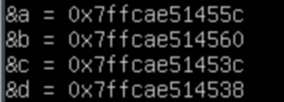

# Ch5 指针与数组

## 5.1

正如作者所说
> `int *p; ` ; 这么做是为了便于记忆，该声明语句表示表达式`*p`的结果是int类型。
那么`double *dp, atof(char *);`，就很好理解了

指针，就是一组存储单元，能够存放一个虚拟地址（通常4-8字节）。

取地址&，的对象要有地址，
谁才有地址呢？ 内存里的变量与数组元素有地址；表达式，常量和register类型不行

`*p++`,`(*p)++` , 一元运算符，结合顺序从右到左。


## 5.2

参数传值，是用的寄存器啊，那么对参数取地址会怎么样呢
```C
int test(int c, int d){
    printf("&c = %p\n", &c);
    printf("&d = %p\n", &d);
    return c+d;
}
int main(void){
    int a = 1;
    int b = 2;
    printf("&a = %p\n", &a);
    printf("&b = %p\n", &b);
    int e =test(a,b);
    return 0;
}
```
输出结果



反汇编发现，在因为test函数中存在取地址运算，函数会分配栈空间，存着c和d
```asm
sub    $0x10,%rsp
mov    %edi,-0x4(%rbp)
mov    %esi,-0x8(%rbp)
```

## 5.3

> 用指针编写的程序要比用数组下标的程序快

`pa = &a[0] ; pa = a` 这两种写法一个味

但是要记住，指针是个变量，数组名只是个地址

`strlen(a)`,意味着指针参数pa，指向了数组a的首地址，那么这个参数可以自增，解引用，求长度了
> 如果确信存在相应元素，p[-1],p[-2],在语法上是合法的，但访问超出数组边界是违法的。
> C语言的定义保证数组末尾之后的第一个元素的指针算数运算可以正确执行

> 在**函数定义**中，**形式参数** 
>` char s[];`
>和
>` char *s;`
>是等价的，习惯于后者，因为后者更直观的表明该参数是个指针

等个p的价！？？？
确实等价，但是为啥，为啥` char s[];`不在函数的栈里分配一个数组呢？**见5.5**

## 5.4

**允许**
* 相同类型指针的赋值运算
* 指针和整数的加减运算（不考虑`void *`）
* 指向同一个数组里的，两个指针，可以相减，比较大小。
* 指针可以赋值为0（NULL），也可以和0进行任意比较，

**不允许**
* 不经强制转换，直接将指向一种对象类型的指针赋值给指向另一种对象类型的指针（二者之一有`void *`除外）

```C
#include<stdio.h>

int main(void){
    int n = -1;     // movl    $-1, -44(%rbp)    0xffffffff
                    //leaq    -44(%rbp), %rax  

    void *a = &n;   //movq    %rax, -40(%rbp)   这是允许的，左侧是void *，即a指向b，a存着b的地址
                    //movq    -40(%rbp), %rax

    int *b = a;     //movq    %rax, -32(%rbp)    意思是给b赋值 a，b也存着n的地址，二者指向同一地址咯，右侧的类型是void *，也允许
                    //leaq    -44(%rbp), %rax

    char *c = &n;   //movq    %rax, -24(%rbp)    会提示warning，初始化指针类型不匹配
                    //movq    -32(%rbp), %rax

    char *d = b;    //movq    %rax, -16(%rbp)    会提示warning，初始化指针类型不匹配
    return 0;
}
```

所以有个很疑惑的地方就是，&n得到的右值也有类型咯？
取地址，取地址，既然得到一个值，就一定有类型，那么类型为什么不是`void *`，这种通用的类型呢？
根据错误信息，可以确定&n就是有类型，类型就是`int *`

## 5.5

`printf("abc");`其实是传递了.string段的地址给%rdi，在调用printf。

```C
#include<stdio.h>
#include<string.h>
#include<unistd.h>
void test1(char *ps){
    write(1,ps,strlen(ps));       // %rdi指向字符串咯，可以不在栈里存ps的值，总归栈里没有字符串
}

void test2(char ps[]){
    write(1,ps,strlen(ps));     // 说实话，就很怪，确实汇编代码和test1一模一样，应该是等价的
}                               // 确实，毕竟那一长串字符串不是局部变量，没资格放在栈里
                                // 这时候，下面main里的两种调用，传递给test2，指针或者.string的地址，也没区别

int main(void){
    char s1[] = "RTFM";    // s1是个字符串数组 是局部变量，在栈里  movl   $0x4d465452,-0xd(%rbp)
                           //                                   movb   $0x0,-0x9(%rbp)
                           // 没有s1这个指针，栈里也没有分配空间

    printf("char s1[] , s1 in  : %p\n",s1); // 运行发现，s1这个字符串数组在栈里，高位置0x7fxxxxxx；

    char *s2 = " RTFM2";  // "RTFM2"是在.string里, 但s2这个指针在main的栈里,把地址存在里面
                          // 运行发现， leaq .LC3(%rip), %rax ；movq  %rax, -24(%rbp)

    test1(s1);  // 传递了字符数组名，也是个地址
    test2(s1);
    test1(s2);  // 传递了一个指针值，是" RTFM2"在.string的地址（从栈里的s2取得）
    test2(s2);
    
    return 0;
}
```

## 5.6

`char *lineptr[MAXLINES]`,
lineptr是数组名，该数组有MAXLINES个元素，