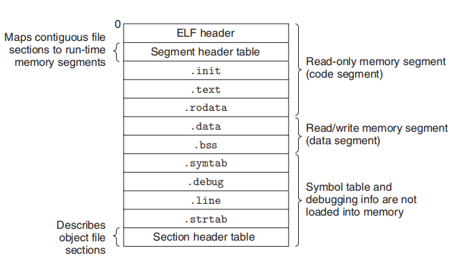
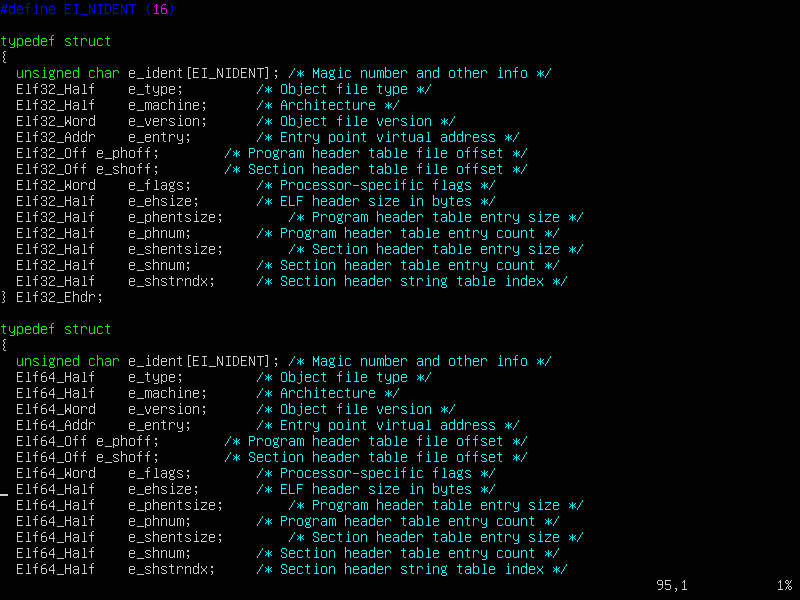
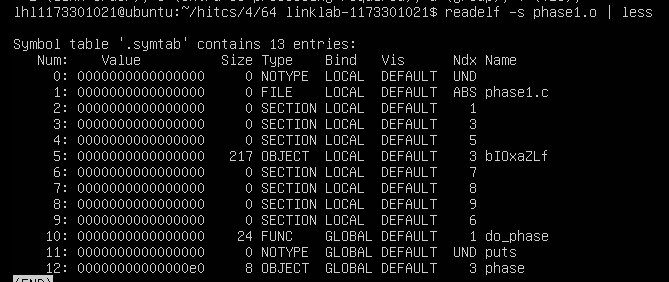

Elf文件


首先要搞明白section，section header，section headers

section：是ELF文件掐头去尾，中间的是一个个的section节，有size，可以放数据，代码等等

section header：表明某个section的信息，这是个结构体定义的，能在elf.h里面直接看到，但是它存在在哪里呢？

section headers：等价于 section header table，也就是elf文件末尾的节头部表，顾名思义，里面存着各个节的信息咯，
这里就是section header存着的地方，从而通过readelf -t或者-S，能看到各个节的信息。
可以通过readelf -s，同时打开winhex查看，先找到section header table的偏移处，比对每一个section发现，
每64字节存着一个section header（x86-64，linux）


ELF header
想知道ElF头有什么用？
首先可以在/user/include/elf.h里面，直接读！

就知道了它的结构，看注释
然后就是对main.o和main.out用readelf -h 直接看
有个比较离谱的事儿，-h显示的section headers意思其实就是节头部表！
能发现，文件头大概就是说明机器信息，字长，大小端
还有一些索引，例如program header table（可执行elf文件才有），section header string table和节头部表（section headers）的位置（在这个elf文件里），以及它们的size
假如是最终的可执行文件，还有个重要的entry point address，就是程序入口，也就是.init函数地址
应该是很接近0x400000的


段头部表Segment header table，在可执行ELF文件里是在ELF header下面
功能是可以把连续的sections，映射到内存上，其实就是program header table
既然是个table就是有条目的，每个条目把一整个段映射到内存上
例子里是把elf文件offset偏移处的代码段映射到内存某个位置vaddr，要映射的段多长呢
就是filesz: segment size in object file;而内存的**边界**呢，
就是memsz: segment size in memory，
对于数据段（.bss,.data),memz可能会大于filesz,因为在ELF文件里，.bss不占用size空间，
而映射到了内存，就需要分配空间了

.init节
就是机器指令，程序加载到内存后，loader完成后，将控制转移到_init函数，就是这里，
为什么能知道转移到这里呢？因为elf头的entry point address.

只读代码段(.text,.rodata)

数据段(.data,.bss)
上面这些都是早晚会加载到内存里的


伪节
**每个符号**都被分配到目标文件的某个节
符号表条目的section字段是到节头部表的索引
而存在这么三个伪节(pseudosections)，ABS，UNDEF，COMMON，
**节头部表没有它们的条目**，但是可以把某些符号分配到这些伪节来，
ABS: symbols that should not be relocated.
UNDEF: undefined symbols—that is, symbols that are referenced in this object module but defined elsewhere
COMMON:uninitialized data objects that are not yet allocated
只有可重定位文件才有这些伪节，看功能就知道，重定位之后，就没必要了


> exit  0x7f23ecdddd40 其他模块声明本模块使用的是外部符号，UNDEF伪节
exit函数地址在运行时堆和用户栈之间，意味着在共享库

COMMON和.bss节，二者的区别：
前者： Uninitialized global variables
后者： Uninitialized static variables, and global or static variables that are
initialized to zero

局部变量，在于它是不是static，若不是，就在栈里管理，
若是static静态的局部变量，就根据有没有初始化，分配到.bss或.data,
且在符号表里有条目（？还是在节头部表有条目）


局部变量到底是该在栈里还是寄存器里，总之print地址的时候都是在栈里，
但是假如不print


malloc不都是堆吗？mmap和heap-brk的区别，反正是看地址能看出啦，小于等于128Kb的malloc区域，在低地址


symtab符号表，是由汇编器构造的，使用的是编译器输出到汇编语言.S文件里的符号
```C
typedef struct {
 int name; /* String table offset */
 char type:4, /* Function or data (4 bits) */
 binding:4; /* Local or global (4 bits) */
 char reserved; /* Unused */
 short section; /* Section header index ，就是readelf里的Ndx*/
 long value; /* Section offset or absolute address，从这个节开始 */
 long size; /* Object size in bytes */
 }
```
符号的名字用name到字符串表.strtab去找,name是个int，是在.strtab里的偏移

符号表不止有符号，还可以包含各个节的条目，以及对应原始原文件的路径的条目， 

Num1那个type就是FILE，name来自于字符串表，是原始原文件的路径的条目咯。
还有些type是SECTION的，看不到名，不太清楚有什么用，但意思是各个节的条目，看Ndx知道
符号被分配到不同的节

readelf -s看到的那些，实际上不只是由符号表构成的
可以用readelf -x .symtab 查看.symtab节，会发现没有符号的名的字符串，
存放着程序中定义和引用的函数和全局的信息，例如

字符串表，不仅有.symtab和.dabug节中的符号表，还有节头部中的节名字


链接器的符号有三种：
1. Global symbols that are defined by module m and that can be referenced by
other modules. Global linker symbols correspond to nonstatic C functions and
global variables.
1. Global symbols that are referenced by module m but defined by some other
module. Such symbols are called externals and correspond to nonstatic C
functions and global variables that are defined in other modules.
1. Local symbolsthat are defined and referenced exclusively by modulem. These
correspond to static C functions and global variables that are defined with the
static attribute. These symbols are visible anywhere within module m, but
cannot be referenced by other modules.

.symtab不包含对应于本地非静态变量的任何符号，这些符号由栈管理，链接器不感兴趣

## 7.6 符号解析

